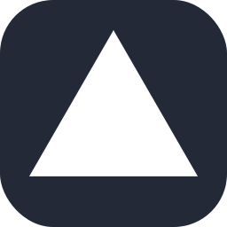

  

<h1 align="center">😸Hello, I'm Grzegorz  </h1>

    
<a href ="https://linktree.com/grzegorzkmita" > All the relevant links + resume 💛</a>
 

    </img>

  <h2> <strong> My Github Stats </strong> </h2>

    

  

  

  

</img>

  

                   

                   

<h3>Personal profile</h3>

 As a passionate computer science student, with a strong fixation on software engineering, I am excited to apply my communication proficiencies and technical understanding to offer meaningful input to the building of applications.
My dominant language is Python, although I am currently learning C too. My educational background involves courses in Python, Access, and Excel. 

         

                   <h3>Technology</h3>

 

<a href="https://www.python.org"><picture><source media="(prefers-color-scheme: dark)" srcset="images/Python-Light.svg">
</picture></a> 
 

 

<a href="https://sass-lang.com/"><picture><source media="(prefers-color-scheme: dark)" srcset="images/Sass.svg">
</picture></a>
<a href="https://tailwindcss.com/"><picture><source media="(prefers-color-scheme: dark)" srcset="images/TailwindCSS-Light.svg">
</picture></a>

<a href="https://www.mathworks.com/products/matlab.html"><picture><source media="(prefers-color-scheme: dark)" srcset="images/Matlab-Light.svg">
</picture></a>

<a href="https://www.markdownguide.org/"><picture><source media="(prefers-color-scheme: dark)" srcset="images/Markdown-Light.svg">
</picture></a>

<a href="https://en.wikipedia.org/wiki/PowerShell"><picture><source media="(prefers-color-scheme: dark)" srcset="images/Powershell-Light.svg">
</picture></a>
<a href="https://en.wikipedia.org/wiki/Linux"><picture><source media="(prefers-color-scheme: dark)" srcset="images/Linux-Light.svg">
</picture></a>
<a href="https://vercel.com/"><picture><source media="(prefers-color-scheme: dark)" srcset="images/Vercel-Light.svg">
</picture></a>
<a href="https://github.com/Jirafey/grzegorzkmita.com"><picture><source media="(prefers-color-scheme: dark)" srcset="images/Github-Light.svg">
</picture></a>
<a href="https://code.visualstudio.com/"><picture><source media="(prefers-color-scheme: dark)" srcset="images/VSCode-Light.svg">
</picture></a>                                    
<a href="https://unity.com/"><picture><source media="(prefers-color-scheme: dark)" srcset="images/Unity-Light.svg">
</picture></a>                               
<a href="https://stackoverflow.com/users/17820864/jirafey"><picture><source media="(prefers-color-scheme: dark)" srcset="images/StackOverflow-Light.svg">
</picture></a>
<a href="https://www.linkedin.com/in/grzegorzkmita/"><picture><source media="(prefers-color-scheme: dark)" srcset="images/LinkedIn (1).svg">
 
<a href="https://mastodon.social/explore"><picture><source media="(prefers-color-scheme: dark)" srcset="images/Mastodon-Light.svg">
</picture></a>

<a href="https://figma.com"><picture><source media="(prefers-color-scheme: dark)" srcset="images/Figma-Light.svg">
</picture></a>
<a href="https://git-scm.com/">

<h3> Published games on itch.io </h3>
                                                                             

                                                                           

<a href="https://jirafey.itch.io/teacup-adventure">
Teacup Adventure
</a>

2D platformer with interesting mechanic: when you jump, water comes out of the teacup, you need to catch it in order to jump again!
Made in Python's library: pygame(NO GAME ENGINE)

<a href="https://jirafey.itch.io/squaremadness">
Square Madness 
</a>
              
A game where you try to withstand a wave of enemies, whilst constantly upgrading your ship! This is a 2D game. There's implemented music, sound, video settings & proper menu. This is a submisson for Geojam 2022 and was built in 3 days! Made in Python's library: pygame(NO GAME ENGINE).

<a href="https://jirafey.itch.io/pong">

Pong 
</a>

Retro pong game, recreated in Python's library turtle(NO GAME ENGINE).

  

#
                    

 
   
<table>

<h3>Projects</h3>

<tr>
<td>      
</td>

<td>

</td>
</tr>
<tr>
<td>

</td>
<td>
</td>
<tr>
<td>
</td>
<td>
</td>
</tr>
</table>

Personal Interests and Hobbies

- In my free time, I am passionate about open-source projects, and I am interested in mastering social interactions, meditation, cold showers, and massage. I also enjoy learning new things everyday, reading books, cooking, swimming. 

 - I am constantly working to improve my language skills, including Polish - Native, English - C1, Chinese(Mandarin) - B1, German - A2, Dutch - A1, I can read Russian, Japanese(katakana and hiragana), and Korean, but I do not speak them well enough. Additionally, I am a promoter of talking to strangers/ meeting up with friends whenever possible.

 - I also feel like I could be in this business as a project manager or someone that based on client needs and my knowledge of programming capabilities of certain technologies can deliver proper technical language for programming team. Also there is a lot of resumes, feel free to take a look: <a href= "https://github.com/Jirafey/Jirafey/tree/main/resumes">Resumes

 <h5> Links to cool stuff that makes up my profile</h5> 

[`Gradient GitHub Stats`](https://github.com/anuraghazra/github-readme-stats#readme)

[`GitHub contributions snake`](https://github.com/Platane/snk#readme)

[`Skill icons`](https://github.com/tandpfun/skill-icons#readme)

[`Running cat GIF creator`](https://giphy.com/otajaider) 
                    
[`Repository templates`](https://github.com/wei/socialify#readme)
                    
[`GitHub streaks`](https://github.com/DenverCoder1/github-readme-streak-stats#readme)
                    
  

 If you liked my profile, you can <b>star⭐</b><a href=https://github.com/jirafey/jirafey>the repo</a> and if you want to use this template you can <a href=https://github.com/jirafey/jirafey/fork> <b>fork it</b></a> and use it.

                    

                    

             

                   

  

                   

