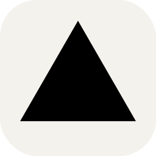
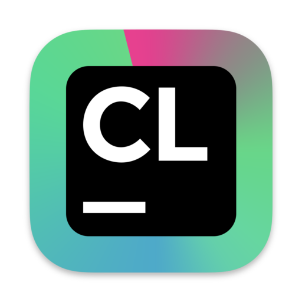

<!-- individual links and https://simpleicons.org/ !-->
<!-- in your header -->
<link rel="stylesheet" href="https://cdn.jsdelivr.net/gh/devicons/devicon@latest/devicon.min.css">

  

  
# `Hello 😸, I'm Grzegorz`
<a href="https://www.buymeacoffee.com/jirafey"> Support my work 💛</a>
  
######   
  

Stats:

#

<a href="https://grzegorzkmita.com">Personal website</a>

                   

  <a href="grzegorz-kmita-resume.pdf">Resume</a>

 
  <a href="grzegorz-kmita-resume.pdf">

<a href="https://grzegorzkmita.com"><picture><source media="(prefers-color-scheme: dark)" srcset="images/Python-Dark.svg">
</picture></a>                                                                                   

  
 
<a href="https://grzegorzkmita.com"><picture><source media="(prefers-color-scheme: dark)" srcset="images/Markdown-Dark.svg">
</picture></a>
<a href="https://grzegorzkmita.com"><picture><source media="(prefers-color-scheme: dark)" srcset="images/Matlab-Dark.svg">
</picture></a>

<a href="https://grzegorzkmita.com"><picture><source media="(prefers-color-scheme: dark)" srcset="images/Github-Dark.svg">
</picture></a>                                                                                     <a href="https://grzegorzkmita.com"><picture><source media="(prefers-color-scheme: dark)" srcset="images/Vercel-Dark.svg">
</picture></a>

<!--  do all the icons like this :)-->
  

<a href="https://grzegorzkmita.com"><picture><source media="(prefers-color-scheme: dark)" srcset="images/VSCode-Dark.svg">
</picture></a>                           

<a href="https://grzegorzkmita.com">
<picture><source media="(prefers-color-scheme: dark)" srcset="https://cdn.simpleicons.org/Unity/">
</picture></a>
  

                                   
<a href="https://grzegorzkmita.com"><picture><source media="(prefers-color-scheme: dark)" srcset="images/StackOverflow-Dark.svg">
</picture></a>                                                                                                            
<a href="https://grzegorzkmita.com">                                                                                                           
<picture><source media="(prefers-color-scheme: dark)" srcset="images/LinkedIn.svg">
</picture></a>
                                                                                       
  
  

#
                                                                            
<h3><a href="https://jirafey.itch.io"> :video_game: Published games on itch.io:</h3></a>

          

                  
 

  

  

<h5>💬 </h5>
 

Polish - Native  
English - C1  
Chinese (Mandarin) - B1  
German - A2  
Dutch - A1  

#

 

 <h5> Links to cool stuff that makes up my profile</h5> 

[`Gradient Github Stats`](https://github.com/anuraghazra/github-readme-stats#readme)

[`Github contributions snake`](https://github.com/Platane/snk#readme)

[`Skill icons`](https://github.com/tandpfun/skill-icons#readme)

[`Running cat GIF creator`](https://giphy.com/otajaider)
                    
[`Simple icons`](https://github.com/simple-icons/simple-icons#readme)

                                                                                                                         

